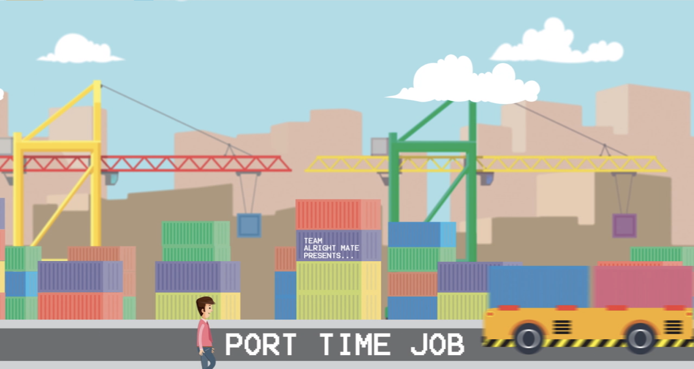
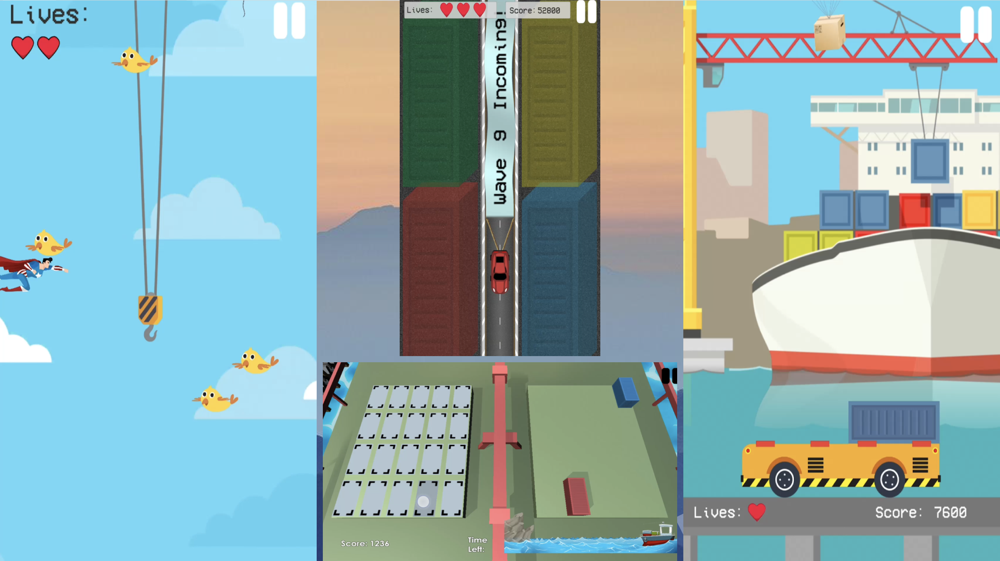

# PortTimeJob

## PortTimeJob was a entry to PSA's GameIt Game Design Competition in 2017. My team won 2nd place and a $5000 cash prize. 

PortTimeJob is a game revolving around PSA's operations, encompassing elements of their work in 4 different minigames, of which I worked on one of them. 

I worked with the game in the upper middle and some of the transition scenes/loading screen for the game. 

